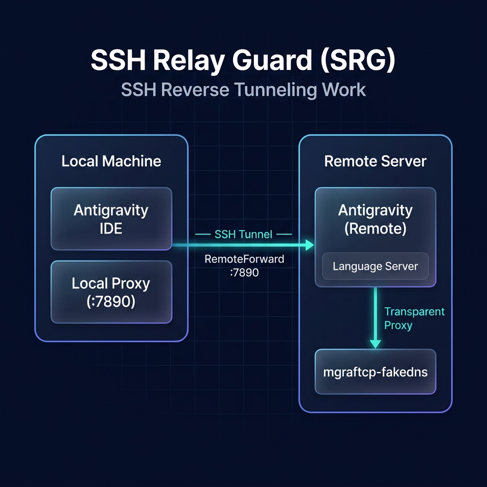
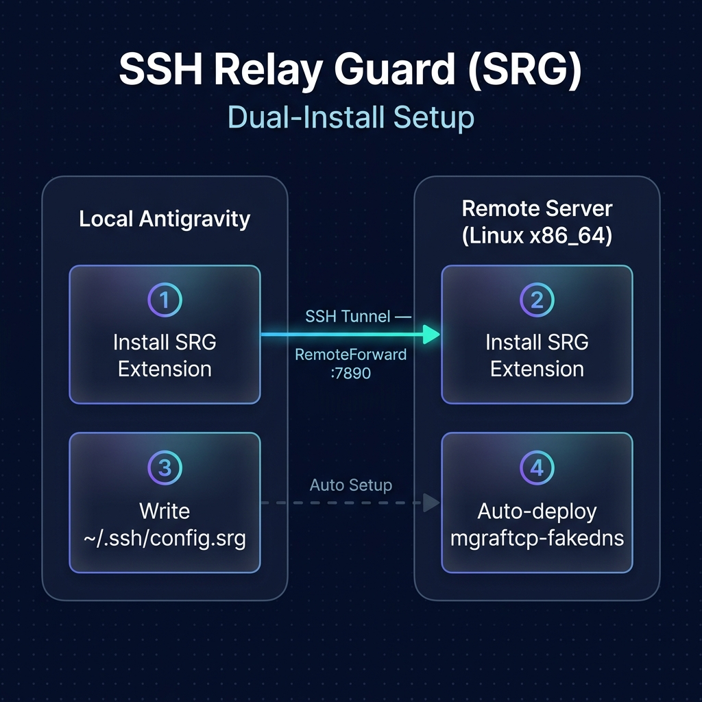

[中文](README.zh-CN.md) | **English**

<p align="center">
  
</p>

# SSH Relay Guard (SRG)

**SSH Relay Guard** is an Antigravity extension that manages SSH reverse tunnels and transparently routes remote traffic through your local proxy — bypassing network restrictions and DNS pollution on remote servers.

> GitHub: [double12gzh/ssh-relay-guard](https://github.com/double12gzh/ssh-relay-guard)

---

## Features

- 🔒 **SSH Reverse Tunnel** — Automatically configures `~/.ssh/config.srg` with per-host `RemoteForward` and `ControlMaster` blocks.
- 🛡️ **Language Server Proxy** — Wraps the remote language server binary with `mgraftcp-fakedns` for transparent process-level proxy, bypassing DNS pollution.
- 📊 **Status Dashboard** — Real-time panel showing local/remote proxy health, SSH tunnel state, and connection metrics.
- 🔍 **Health Check** — Full diagnostic suite: local proxy, SSH config, remote port forwarding, binary check, external connectivity, and DNS pollution detection.
- 📈 **Traffic Monitor** — Live connection count and session statistics on the remote side.
- 🌐 **Bilingual UI** — Chinese and English support.

---

## How It Works



1. On the **local machine**: the extension writes an SSH config block in `~/.ssh/config.srg` that forwards the remote proxy port back to your local proxy.
2. On the **remote machine**: the extension installs a wrapper script around the language server binary that forces it through `mgraftcp-fakedns`.

📖 **[Manual Reproduction Guide](docs/how-it-works-manual.en.md)** — Explains the minimal commands needed to manually replicate what the extension does, with a full data flow diagram.

---

## Installation

SRG uses a **local + remote dual deployment** model, with each side handling different tasks:



### Environment Requirements

- A running local proxy (Clash / V2Ray / etc.) with working Antigravity AI features **confirmed locally**
- A remote Linux x86_64 server accessible via SSH

---

## Quick Start

**Local side**

1. Search for and install **SSH Relay Guard** in the Antigravity extension marketplace
2. Open settings and set `localProxyPort` to your local proxy port (default `7890`)
3. Run command `SSH Relay Guard: Add Host Forwarding` and enter the remote hostname (as in `~/.ssh/config`)

**Remote side**

4. Connect to your remote server via SSH through Antigravity
5. Install **SSH Relay Guard** again in the remote extension list
6. Restart the remote window when prompted (may require multiple restarts)

**Verify**

7. Open the SRG Dashboard → Run "Health Check" → All items showing ✅ means setup is complete

---

## Configuration

| Setting | Default | Description |
|---|---|---|
| `ssh-relay-guard.enableLocalForwarding` | `true` | Enable SSH reverse tunnel management |
| `ssh-relay-guard.localProxyPort` | `7890` | Local proxy port (e.g., Clash, V2Ray) |
| `ssh-relay-guard.remoteProxyPort` | `7890` | Remote proxy port (must match local) |
| `ssh-relay-guard.remoteProxyHost` | `127.0.0.1` | Remote proxy host address |
| `ssh-relay-guard.proxyType` | `http` | Proxy protocol: `http` or `socks5` |
| `ssh-relay-guard.showStatusOnStartup` | `true` | Show status notification on connection |

---

## Commands

| Command | Description |
|---|---|
| `SSH Relay Guard: Show Dashboard` | Open the status dashboard |
| `SSH Relay Guard: Add Host Forwarding` | Configure SSH tunnel for a host |
| `SSH Relay Guard: Remove Host Forwarding` | Remove SSH tunnel for a host |
| `SSH Relay Guard: Run Health Check` | Full diagnostic report |
| `SSH Relay Guard: Setup Remote Environment` | Install language server wrapper |
| `SSH Relay Guard: Rollback Remote Environment` | Restore original language server |
| `SSH Relay Guard: Show Traffic Monitor` | View connection statistics |

---

## srg-cli (Optional, Standalone Tool)

> **srg-cli is NOT bundled with the extension.** It is a standalone command-line tool for users who don't use Antigravity or need to manage multiple remote hosts from the terminal.
>
> If you only use Antigravity, **you do NOT need srg-cli** — the extension handles everything automatically via the `Setup Remote Environment` command.

### Installation

```bash
# Clone the repository
git clone https://github.com/double12gzh/ssh-relay-guard.git
cd ssh-relay-guard/srg-cli

# (Optional) Build mgraftcp-fakedns pre-compiled binaries
# Requires Linux + go, make, gcc
bash build-bin.sh

# Add srg to PATH
export PATH="$PWD:$PATH"
# Or create a symlink
ln -s "$PWD/srg" /usr/local/bin/srg
```

### Usage

```bash
# One-time setup for a remote host
srg setup my-server

# Check status
srg status my-server

# Diagnose issues (full local + remote diagnostics)
srg doctor my-server

# List configured hosts
srg list

# Remove all configuration
srg teardown my-server
```

### Plugin vs srg-cli

| Feature | Antigravity Extension | srg-cli |
|---------|------------------|---------|
| SSH tunnel config | ✅ Automatic | ✅ `srg setup` |
| Language Server proxy | ✅ Automatic | ✅ `srg setup` |
| Remote tool deployment (srg-on/off/...) | ✅ Automatic (embedded scripts) | ✅ `srg setup` (standalone scripts) |
| Status dashboard | ✅ WebView panel | ✅ `srg status` / `srg tui` |
| Health diagnostics | ✅ In-panel | ✅ `srg doctor` |
| Requires Antigravity | ✅ Yes | ❌ No |
| Multi-host management | ⚠️ One window per host | ✅ `srg list` centralized |

### Remote Commands (available after setup)

| Command | Description |
|---|---|
| `srg-on` | Enable proxy for current shell |
| `srg-off` | Disable proxy for current shell |
| `srg-shell` | Open a new shell with proxy enabled |
| `srg-proxy <cmd>` | Run a single command through transparent proxy |
| `srg-status` | Show current proxy status |

---

## SSH Config Format

SRG uses a dedicated `~/.ssh/config.srg` file included from the main SSH config:

```
# SSH Relay Guard — Tunnel & Proxy Config
# --- SRG:my-server ---
Host my-server
    RemoteForward 7890 127.0.0.1:7890
    ExitOnForwardFailure no
    ControlMaster auto
    ControlPath ~/.ssh/sockets/%r@%h-%p
    ControlPersist 4h
# --- SRG:my-server END ---
```

---

## Uninstall

When uninstalling, the extension automatically cleans up local SSH configuration (`~/.ssh/config.srg` and the `Include` line in `~/.ssh/config`). No manual rollback is needed.

Remote artifacts (LS wrapper, `~/bin/srg-*` tools) are safe to leave — the LS wrapper has a built-in fallback that runs the original binary if `mgraftcp` is missing. To fully clean up the remote server, run `SSH Relay Guard: Rollback Remote Environment` before uninstalling.

---

## Development

Common commands for developing and packaging the extension:

```bash
# Install dependencies
npm install

# Compile the extension
npm run compile

# Watch for changes and recompile
npm run watch

# Run tests
npm run test

# Run linting
npm run lint

# Package extension into a .vsix file
npx vsce package --no-dependencies

# Publish the extension
npx vsce publish
```

---

## License

MIT © [double12gzh](https://github.com/double12gzh)
